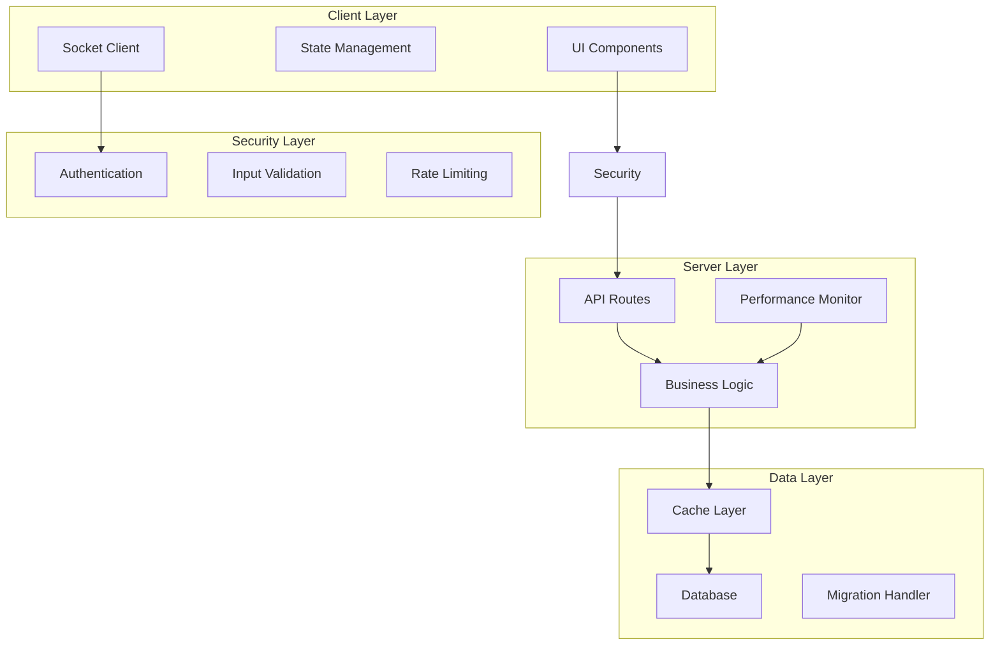

# Design Document: Kvant Bug Fixes & Improvements

## Overview

Данный документ описывает архитектурное решение для системного исправления критических багов в Kvant мессенджере. Основной принцип - постепенное улучшение без нарушения существующей функциональности через применение паттерна Facade и инкрементальный рефакторинг.

## Architecture

### Current State Analysis

Текущая архитектура представляет собой монолитную структуру с тремя основными файлами:
- `server.js` - серверная логика (Express + Socket.IO)
- `database.js` - работа с базой данных (SQLite/PostgreSQL)
- `public/app.js` - клиентская логика

### Target Architecture



### Gradual Migration Strategy

1. **Facade Pattern Implementation**: Создание обёрток над существующими функциями
2. **Incremental Extraction**: Постепенное выделение логики в утилитарные функции
3. **Backward Compatibility**: Сохранение всех существующих API
4. **Testing at Each Step**: Проверка работоспособности после каждого изменения

## Components and Interfaces

### Security Layer

#### Input Sanitization Module
```javascript
// Новый модуль: utils/security.js
const SecurityUtils = {
    sanitizeInput(input, type = 'text') {
        // Санитизация входных данных
    },
    
    escapeHtml(text) {
        // Экранирование HTML
    },
    
    validateJWT(token) {
        // Валидация JWT токенов
    }
};
```

#### Rate Limiting Module
```javascript
// Новый модуль: utils/rateLimiter.js
const RateLimiter = {
    createLimiter(options) {
        // Создание rate limiter
    },
    
    checkLimit(userId, action) {
        // Проверка лимитов
    }
};
```

### Database Layer Improvements

#### Query Optimization Module
```javascript
// Расширение database.js
const DatabaseOptimizer = {
    preparedStatements: new Map(),
    
    getPreparedStatement(query) {
        // Кэширование подготовленных запросов
    },
    
    executePaginated(query, params, limit, offset) {
        // Пагинированные запросы
    }
};
```

#### Connection Management
```javascript
// Улучшение database.js
const ConnectionManager = {
    primaryConnection: null,
    fallbackConnection: null,
    
    async getConnection() {
        // Автоматический fallback на SQLite
    },
    
    async executeWithFallback(query, params) {
        // Выполнение с fallback
    }
};
```

### Memory Management

#### Resource Cleanup Module
```javascript
// Новый модуль: utils/cleanup.js
const ResourceCleanup = {
    timers: new Set(),
    listeners: new Map(),
    
    addTimer(timerId) {
        // Регистрация таймера
    },
    
    cleanup() {
        // Очистка всех ресурсов
    }
};
```

#### Socket Connection Manager
```javascript
// Улучшение server.js
const SocketManager = {
    connections: new Map(),
    
    addConnection(socket) {
        // Регистрация соединения
    },
    
    cleanupConnection(socketId) {
        // Очистка соединения
    }
};
```

### UI/UX Consistency Layer

#### Component Style System
```javascript
// Новый модуль: public/js/components.js
const UIComponents = {
    createButton(text, type = 'primary') {
        // Создание кнопки в едином стиле
    },
    
    createModal(title, content) {
        // Создание модального окна
    },
    
    showLoader(target) {
        // Показ индикатора загрузки
    }
};
```

#### Responsive Layout Manager
```javascript
// Новый модуль: public/js/responsive.js
const ResponsiveManager = {
    breakpoints: {
        mobile: 768,
        tablet: 1024
    },
    
    adaptLayout() {
        // Адаптация под размер экрана
    },
    
    handleOrientationChange() {
        // Обработка поворота экрана
    }
};
```

### Performance Monitoring

#### Performance Monitor Module
```javascript
// Новый модуль: utils/monitor.js
const PerformanceMonitor = {
    metrics: {
        dbQueries: [],
        memoryUsage: [],
        socketEvents: []
    },
    
    logSlowQuery(query, duration) {
        // Логирование медленных запросов
    },
    
    checkMemoryUsage() {
        // Мониторинг памяти
    },
    
    trackSocketReconnections(socketId) {
        // Отслеживание переподключений
    }
};
```

## Data Models

### Enhanced User Model
```javascript
// Расширение существующей модели пользователя
const UserModel = {
    // Существующие поля сохраняются
    id: 'INTEGER PRIMARY KEY',
    username: 'TEXT UNIQUE',
    email: 'TEXT',
    
    // Новые поля для безопасности
    last_login: 'DATETIME',
    failed_attempts: 'INTEGER DEFAULT 0',
    locked_until: 'DATETIME',
    
    // Методы валидации
    validate(userData) {
        // Валидация данных пользователя
    }
};
```

### Message Model Enhancement
```javascript
// Расширение модели сообщений
const MessageModel = {
    // Существующие поля
    id: 'INTEGER PRIMARY KEY',
    content: 'TEXT',
    user_id: 'INTEGER',
    
    // Новые поля для безопасности
    sanitized_content: 'TEXT',
    is_system: 'BOOLEAN DEFAULT 0',
    
    // Методы обработки
    sanitize(content) {
        // Санитизация контента
    }
};
```

## Error Handling Strategy

### Centralized Error Handler
```javascript
// Новый модуль: utils/errorHandler.js
const ErrorHandler = {
    logError(error, context) {
        // Централизованное логирование
    },
    
    handleDatabaseError(error) {
        // Обработка ошибок БД
    },
    
    handleSocketError(error, socket) {
        // Обработка ошибок Socket
    },
    
    createUserFriendlyMessage(error) {
        // Создание понятных сообщений
    }
};
```

### Retry Mechanism
```javascript
// Модуль повторных попыток
const RetryManager = {
    async executeWithRetry(fn, maxRetries = 3) {
        // Выполнение с повторными попытками
    },
    
    calculateBackoff(attempt) {
        // Экспоненциальная задержка
    }
};
```

## Testing Strategy

### Unit Testing Approach
- Тестирование каждого нового утилитарного модуля
- Проверка обратной совместимости существующих функций
- Тестирование edge cases для безопасности

### Property-Based Testing
- Тестирование санитизации входных данных на различных входах
- Проверка корректности работы rate limiting
- Валидация производительности оптимизированных запросов

### Integration Testing
- Тестирование fallback механизмов базы данных
- Проверка работы Socket соединений при различных сценариях
- Тестирование UI компонентов на различных устройствах

## Implementation Phases

### Phase 1: Critical Security Fixes (Priority: High)
1. Реализация модуля санитизации входных данных
2. Добавление rate limiting
3. Улучшение JWT валидации
4. Проверка загружаемых файлов

### Phase 2: Performance Optimization (Priority: High)
1. Оптимизация database запросов
2. Реализация кэширования
3. Улучшение connection management
4. Добавление performance monitoring

### Phase 3: Memory Management (Priority: Medium)
1. Реализация resource cleanup
2. Улучшение Socket connection management
3. Оптимизация Map/Set структур
4. Добавление memory monitoring

### Phase 4: UI/UX Improvements (Priority: Medium)
1. Создание единой системы компонентов
2. Улучшение responsive design
3. Добавление accessibility features
4. Унификация стилей

### Phase 5: Code Quality & Architecture (Priority: Low)
1. Постепенное выделение утилитарных функций
2. Рефакторинг больших функций
3. Замена магических чисел на константы
4. Улучшение структуры проекта

## Migration Strategy

### Backward Compatibility Approach
```javascript
// Пример facade паттерна для сохранения совместимости
// Старая функция остается доступной
function oldFunction(param) {
    return newSecureFunction(param); // Перенаправление на новую реализацию
}

// Новая безопасная реализация
function newSecureFunction(param) {
    const sanitized = SecurityUtils.sanitizeInput(param);
    return processSecurely(sanitized);
}
```

### Gradual Rollout Plan
1. **Week 1-2**: Security fixes (критические уязвимости)
2. **Week 3-4**: Database optimization (производительность)
3. **Week 5-6**: Memory management (стабильность)
4. **Week 7-8**: UI/UX improvements (пользовательский опыт)
5. **Week 9-10**: Code quality improvements (поддерживаемость)

### Testing at Each Step
- Автоматические тесты после каждого изменения
- Ручное тестирование критических путей
- Проверка производительности
- Валидация на staging окружении

## Risk Mitigation

### Rollback Strategy
- Сохранение оригинальных функций как fallback
- Возможность быстрого отката через feature flags
- Детальное логирование всех изменений

### Monitoring & Alerting
- Мониторинг производительности в реальном времени
- Алерты при превышении пороговых значений
- Автоматическое переключение на fallback при критических ошибках

## Success Metrics

### Security Improvements
- Устранение всех выявленных уязвимостей
- Снижение количества подозрительных запросов на 90%
- Успешная валидация всех входных данных

### Performance Gains
- Уменьшение времени отклика API на 50%
- Снижение потребления памяти на 30%
- Увеличение стабильности соединений на 95%

### Code Quality
- Снижение дублирования кода на 60%
- Увеличение покрытия тестами до 80%
- Улучшение читаемости кода (субъективная оценка команды)